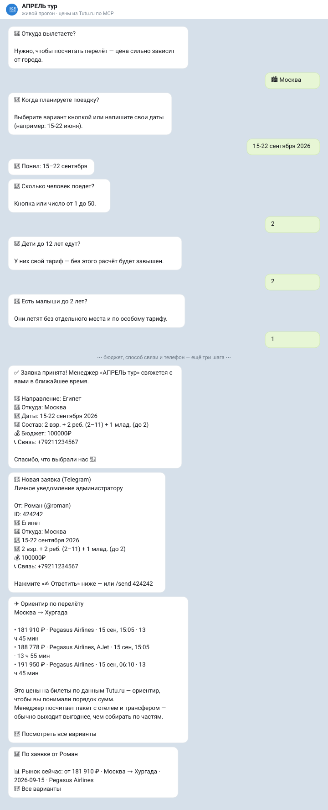

# TurBot — production lead-бот для турагентства

[](https://www.python.org/)
[](https://flask.palletsprojects.com/)
[](https://github.com/r0meo-1/turbot-arhangelsk/actions/workflows/tests.yml)
[](tests)
[](#живое-демо)
[](LICENSE)

> Клиент отвечает на короткие вопросы в Telegram или VK. TurBot превращает
> диалог в структурированную заявку, сохраняет её локально, уведомляет
> менеджера и передаёт данные в CRM. Сбой внешнего API не теряет лид.

Боевой проект для турагентства **«АПРЕЛЬ тур»**, а не учебный echo-бот:
два мессенджера, самостоятельная выдача туров Tourvisor, интеграция с MDT CRM
и Tutu MCP, работа с персональными
данными, мониторинг и воспроизводимый деплой на российский VPS.

`Python` · `Flask` · `gunicorn` · `SQLite` · `Telegram Bot API` · `VK Callback API` · `Docker` · `systemd` · `nginx`

## Кейс в цифрах

| Результат | Реализация |
|-----------|------------|
| **2 канала** | Telegram и VK используют общие модули валидации, дат, CRM и политики ПДн |
| **200 тестов** | Диалоговые ветки, webhook security, Tourvisor, дедупликация, конкуренция, CRM и сетевые ошибки |
| **Подбор без менеджера** | VK показывает туры, фильтрует их по цене, категории и питанию, сравнивает похожие варианты |
| **Заявка сначала сохраняется** | SQLite фиксирует лид до обращения к MDT, Tutu или AI |
| **Продакшен на VPS** | nginx, TLS, systemd, health-check, watchdog, ночные backup и проверяемый deploy |
| **152-ФЗ** | Российский VPS, согласие, политика, retention и удаление данных командой пользователя |

## Живое демо

| Что открыть | Что можно проверить |
|-------------|---------------------|
| [VK-сообщество](https://vk.ru/club240310110) | Боевой вход в диалог и клиентский путь подбора тура |
| [Health API](https://bot.r0meo1.ru/health) | Статус сервиса и ревизию реально запущенного кода |
| [Политика ПДн](https://bot.r0meo1.ru/privacy) | Публичную страницу, которую показывает бот перед сбором контакта |
| [GitHub Actions](https://github.com/r0meo-1/turbot-arhangelsk/actions) | Результаты тестов на каждом push и pull request |
| [Сайт автора](https://r0meo1.ru) | Другие проекты и контакты |

## Что здесь важно инженеру

- **Надёжный критический путь:** лид попадает в БД раньше любого сетевого вызова.
- **Защита от дублей:** повторный webhook и двойное нажатие не создают две заявки.
- **Безопасная деградация:** CRM, Tutu или AI могут упасть, но клиент получает ответ, а менеджер — заявку.
- **Эксплуатация:** deploy сверяет ревизию обоих сервисов, а health-check проверяет не только наличие процесса.
- **Безопасность:** секреты webhook проверяются, токены вырезаются из логов, пользователь может удалить свои данные.

### Как это выглядит



Не скриншот, а SVG, собранный из [реального прогона](tools/render_dialog_svg.py):
`demo_capture.py` гоняет настоящий `bot.py` через настоящий webhook, цены
приходят с живого MCP-сервера Tutu. Картинку можно перегенерировать и
посмотреть в дифе — в отличие от PNG, который остаётся верить на слово.


Свой VPS в РФ, сертификат Let's Encrypt, `/health` отвечает за **~0.5 с**.
Ни холодного старта, ни засыпания: то, ради чего проект уехал с бесплатного
Render, где первый запрос стабильно не укладывался в 45 секунд.

**Демо-режим.** Флаг `DEMO_MODE` переключает боевой контур и витрину. В режиме
витрины бот прямо предупреждает, что это демонстрация, заявка не уходит в
турагентство, а телефон хранится замаскированным (`+7916***4567`) — чтобы
публичная ссылка не собирала чужие ПДн от лица реального ИП. Включается сам на
Render (по переменной `RENDER`), на своей VM выключен. Цены на перелёт в обоих
режимах настоящие: они приходят из Tutu.ru по MCP.

---

## Что умеет (спойлер: не только `/start`)

- **Диалог Telegram** — согласие → направление → **город вылета** → даты → люди → бюджет → способ связи → проверка заявки → отправка менеджеру  
- **Живые цены** — реальные рейсы из Tutu.ru по MCP вместо выдуманной AI-подборки  
- **Кнопки** — популярные страны, «Назад», «Отмена», share contact  
- **Бюджет** — одна максимальная сумма: `100000`, `100 000 ₽`, `100 тыс` или `100к`. Диапазон `100000–120000` просит уточнить лимит и не склеивает числа. В Telegram сумма на человека, в VK — на всю поездку.  
- **Проверка заявки** — в Telegram контакт сохраняет черновик; отправка менеджеру требует отдельного нажатия. Можно изменить поля или отменить. Кнопка старой версии черновика не отправляет новую заявку.  
- **AI / template** — Groq или локальные шаблоны (`AI_MODE=template`, без «а у нас VPN лёг»)  
- **SQLite** — сессии, юзеры, **история leads** (да, `/export` теперь не пустой — мы тоже удивились)  
- **Админка** — `/send`, `/broadcast` (в фоне, webhook не стонет), `/stats`, `/analytics`, `/mdt`…  
- **MDT CRM** — lead / preorder / both, push, напоминания  
- **VK-бот** — `vk_bot.py`, тот же мозг в `shared/`, связь через VK / телефон / MAX  
- **Контакты** — согласие перед телефоном, `/privacy`, `/delete` (lead для заявки, не «навсегда в чате»)  
- **Webhook или polling** — `BOT_MODE=polling` для сетей, где Telegram не может достучаться до сервера
- **Прод-мелочи** — secret token, retries, dedup `update_id`, graceful shutdown, алерты админу  

---

## Как это работает

```
Клиент ──/start──► согласие ──► FSM ──► телефон
                                      │
                    ┌─────────────────┼─────────────────┐
                    ▼                 ▼                 ▼
              lead в SQLite    «спасибо» клиенту   пинг админу
                    │
                    └── (фон) MDT + Tutu MCP + AI-подборка
```

MDT, Tutu и AI **не блокируют** ответ Telegram. Потому что ждать LLaMA на webhook — это хобби, а не сервис.

Порядок здесь принципиален: lead попадает в SQLite **до** любого сетевого вызова. Упавшая CRM или лежащий Tutu физически не могут съесть заявку.

| Метод | Путь | Зачем |
|-------|------|--------|
| GET | `/` | «Я жив» |
| GET | `/health` | JSON для uptime (и чтобы было что смотреть в 3 ночи) |
| POST | `/webhook` | Telegram |
| POST | `/vk/webhook` | VK |

---

## Структура

```
bot.py / vk_bot.py   — мессенджер-специфика
shared/              — validation, AI, MDT, privacy, dates…
tests/               — pytest (гоняйте, не верьте README на слово)
deploy/              — systemd, nginx, install.sh
docs/                — политика ПДн (черновик), MDT API
```

---

## Быстрый старт

```bash
git clone https://github.com/r0meo-1/turbot-arhangelsk.git
cd turbot-arhangelsk
python -m venv .venv
# Windows: .venv\Scripts\activate
source .venv/bin/activate
pip install -r requirements.txt
cp .env.example .env   # Windows: copy .env.example .env
```

Минимум в `.env`:

```env
BOT_TOKEN=от_BotFather
ADMIN_ID=узнать_у_@userinfobot
AI_MODE=template
TELEGRAM_SECRET_TOKEN=длинная_случайная_строка_пожалуйста
```

```bash
python bot.py
# или
gunicorn bot:app --bind 0.0.0.0:$PORT --workers 1 --threads 2
```

**`--workers 1`**. Несколько воркеров + in-memory state = «почему у клиента пропал диалог».  
Это не баг gunicorn. Это физика.

Webhook:

```bash
curl "https://api.telegram.org/bot$BOT_TOKEN/setWebhook?url=https://ВАШ_ДОМЕН/webhook&secret_token=$TELEGRAM_SECRET_TOKEN"
```

### Тесты

```bash
pip install -r requirements-dev.txt
pytest
```

---

## Tutu.ru по MCP — живые цены вместо фантазий

Раньше после заявки клиент получал текст от LLM: красиво и полностью выдумано.
Теперь бот идёт в [MCP-сервер Tutu.ru](https://mcp.tutu.ru/mcp) и присылает реальные рейсы.

```
✈️ Ориентир по перелёту
Архангельск → Хургада

• 69 558 ₽ · Смартавиа, Уральские авиалинии · 15 сен, 20:55 · 14 ч 50 мин
• 73 184 ₽ · Аэрофлот, Ред Вингс · 15 сен, 11:10 · 14 ч 5 мин
```

**Почему клиенту не дают ссылку «купить».** Клиент видит ориентир и ссылку на поиск,
менеджер — ту же цену плюс готовый checkout. Кнопка «оплатить» в сообщении клиенту
увела бы продажу мимо агентства, которое зарабатывает на пакете, а не на билете.

**Что оказалось неочевидным при интеграции:**

| Грабли | Решение |
|--------|---------|
| Воронка собирает страны («Египет»), Tutu ищет по городам — и сам резолвит страну в **столицу** | Карта «страна → курорт»: Египет → Хургада, а не Каир. На тех же датах 24 539 ₽ против 36 152 ₽ |
| Города вылета в диалоге не было вообще | Отдельный шаг FSM: цена из Архангельска и из Москвы отличается в разы |
| Пресеты дат хранят «через месяц», «лето» — ISO из этого не получить | Резолвер пресетов в конкретную будущую дату; free-text по-прежнему через `parse_russian_dates` |
| В Telegram бюджет **на человека**, в VK — **на всю поездку**; `price_max` у Tutu за оффер целиком | Для Telegram умножаем на число пассажиров, для VK передаём общий бюджет без повторного умножения |
| Под бюджет клиента может не найтись ничего | Повторный поиск без лимита: менеджер видит рынок, клиенту — честное «не нашлось», а не ценник в 5 раз выше запроса |

**Инженерные решения:**

- **Ноль новых зависимостей.** Сервер — stateless JSON-RPC поверх HTTP POST: без авторизации,
  без `initialize`, без session-id, без SSE. Официальный MCP SDK притащил бы anyio/httpx/pydantic
  ради ничего; на free-tier с 512 МБ это решает. Клиент — ~90 строк на `requests`.
- **Никогда на критическом пути.** Только фоновый поток после сохранения лида.
- **Мягкая деградация.** Таймаут, ретраи, кэш в памяти; при любой ошибке — обычная шаблонная
  подборка. Клиент не видит, что что-то отвалилось.
- **Тесты на сетевую границу.** Таймаут, 500, битый JSON, JSON-RPC error, `isError` —
  и отдельный тест, который сверяет отправляемые параметры со схемой сервера.
  Он появился не просто так: мок радостно проглотил выдуманный `passengers`,
  а живой сервер ответил `extra_forbidden`. Поймал только реальный вызов.

Проверить на живом сервере: `/tutu test` от админа.

---

## Переменные

Полный список — [`.env.example`](.env.example).

| Переменная | Нужно? | Суть |
|------------|--------|------|
| `BOT_TOKEN` | да | Токен бота |
| `ADMIN_ID` | да | Кто получает заявки и админ-команды |
| `AI_MODE` | нет | `groq` / `template` |
| `GROQ_API_KEY` | нет | Без ключа — шаблоны, жизнь продолжается |
| `TELEGRAM_SECRET_TOKEN` | очень желательно | Иначе webhook — общественный туалет |
| `MDT_*` | нет | CRM, когда надо по-взрослому |
| `DATA_RETENTION_DAYS` | нет | 180 по умолчанию — автоочистка старых данных |
| `TUTU_ENABLED` | нет | Живые цены из Tutu.ru по MCP (по умолчанию выкл.) |
| `TUTU_DEFAULT_ORIGIN` | нет | Город вылета, если клиент не выбрал |

---

## Команды

### Клиент

| Команда | Что делает |
|---------|------------|
| `/start` | Начать (сначала согласие, если вы не старый друг) |
| `/cancel` | «Я передумал» |
| `/privacy` | Коротко про ПДн |
| `/delete` | Стереть данные. Серьёзно. |
| `/help` | Справка |

### Админ (`ADMIN_ID`)

| Команда | Что делает |
|---------|------------|
| `/send {id} {текст}` | Личное (HTML ок) |
| `/broadcast …` | Всем или по направлению (фон) |
| `/users` `/stats` `/analytics` `/export` | Метрики и телефоны |
| `/followup` `/restart` `/mdt` | Напоминания, сброс, CRM |
| `/tutu` `/tutu test` | Статус интеграции с Tutu и живая проверка поиска |

---

## Деплой

- **РФ VPS** (если в боте реальные телефоны клиентов) — [DEPLOY.md](DEPLOY.md), `deploy/install.sh`  
- **Docker** — `docker compose up -d` (не забудьте `shared/` — Dockerfile уже в курсе)  
- **Render / free-tier** — годится только как витрина: инстанс засыпает, диск эфемерный, данные вне РФ. Проект с него уехал.

---

## Контакты в боте (без юрпафоса)

Lead = телефон и параметры поездки. Поэтому:

- согласие **до** телефона  
- `/privacy` и `/delete`  
- опционально retention (`DATA_RETENTION_DAYS`)  
- политика: `PRIVACY_POLICY_URL` + черновик [`docs/privacy_policy.md`](docs/privacy_policy.md)

Не претендуем на «сертифицированный комплаенс». Просто не копим контакты в чатах без спроса.

---

## Что ломалось в проде

Четыре вещи, которые нельзя было предусмотреть заранее — только встретить.

**Хостинг фильтрует Telegram в обе стороны.** Симптом обманчивый: сервис
здоров, `/health` отдаёт 200, а `getWebhookInfo` показывает `Connection timed
out` и растущую очередь — при этом в логах nginx **ни одного** запроса от
Telegram. Ни сертификат, ни конфиг не помогут, маршрутом владеет провайдер.
Ответ — `BOT_MODE=polling`: бот сам ходит за апдейтами, и нужен только
исходящий канал. Вебхук остался режимом по умолчанию, оба транспорта идут
через один `dispatch_update()`.

**Токен утекал в логи.** `urllib3` при обрыве соединения пишет полный URL, а
Telegram держит токен в пути — один сетевой сбой, и credential в journald,
откуда он попадает в вырезки логов и тикеты. Фильтр на корневых хендлерах
режет секрет, оставляя id бота.

**Пустое значение в `.env` убивало процесс на импорте.** `int(os.getenv("X",
"0"))` подставляет дефолт, только если переменной **нет**; если она есть и
пуста — `int("")` бросает исключение, и наружу торчит голый `exit 3`. Тест
теперь грепает оба модуля, чтобы это не вернулось с новой настройкой.

**Косметика заблокировала приём сообщений.** На старте бот ставил себе имя,
описания и меню, а уже потом запускал поллер. Telegram жёстко лимитирует
`setMyName`, отвечает `429`, а `429` был в списке кодов для ретрая — три
попытки с нарастающей паузой на каждый из пяти вызовов. Минуты, в которые бот
не читал ничего. Снаружи всё зелёное: `active (running)`, `/health` — 200, в
логе ни одной ошибки. Порядок исправлен, тест фиксирует его; но вывод шире
самого бага — **установка описания не должна решать, читаются ли сообщения**.

Отдельно стоит то, чего в этом списке не хватало: оба раза бота чинил не
мониторинг, а клиент, который не дождался ответа. Проверять «жив ли процесс»
бессмысленно — процесс был жив. Поэтому `/health` теперь докладывает возраст
последнего успешного `getUpdates` и отвечает `503`, когда тот протух, а
[`deploy/watchdog.sh`](deploy/watchdog.sh) по этому коду перезапускает сервис
и пишет в Telegram. Эндпойнт, который всегда отвечает `ok`, — украшение.

Подробности по каждой — в [DEPLOY.md](DEPLOY.md).

---

## Куда смотреть, если вы ревьюер

Не «список технологий», а конкретные места, где видно принятое решение.

| Что посмотреть | Где | Что там интересного |
|---|---|---|
| **Порядок в критическом пути** | [`bot.py`](bot.py) → `handle_completion` | Заявка пишется в SQLite и уходит менеджеру **до** любого сетевого вызова. CRM и Tutu — в фоновом потоке. Упавший внешний сервис не может съесть лид |
| **Возраст вместо диапазона** | [`shared/validation.py`](shared/validation.py) → `party_bands` | Спрашивался «сколько детей 2–11» и отдельно «сколько до 2» — два ответа могли противоречить друг другу, а менеджер всё равно переспрашивала возраст. Теперь состав — два числовых шага: сколько взрослых и возрасты детей списком. Вопрос «дети до 12 едут?» убран: он спрашивал то, что и так видно из возрастов. Полосы тарифов выводятся из них — 14 лет уходит во взрослые, потому что авиакомпания посчитает именно так |
| **Защита от дублей** | `handle_completion`, флаг `_completing` | При `--threads 2` двойной тап по кнопке даёт два разных апдейта; дедуп по `update_id` их не ловит. Check-and-set под тем же локом, что и `user_data` |
| **Клиент MCP без SDK** | [`shared/tutu.py`](shared/tutu.py) | Сервер оказался stateless JSON-RPC поверх POST. Официальный SDK притащил бы anyio/httpx/pydantic ради ничего — на 512 МБ это решает |
| **Тесты на сетевую границу** | [`tests/test_tutu.py`](tests/test_tutu.py) | Таймаут, 500, битый JSON, JSON-RPC error. Плюс тест, сверяющий аргументы со схемой сервера — появился после того, как мок проглотил выдуманный параметр |
| **Почему `--workers 1`** | `Procfile`, `Dockerfile`, README выше | Сессии и дедуп живут в памяти процесса. Ограничение осознанное и задокументировано, чтобы никто не «отмасштабировал» |
| **Работа с ПДн** | `DEMO_MODE`, `/privacy`, `/delete` | Витрина не собирает настоящие номера; политику бот отдаёт сам; удаление и retention реально удаляют строки |
| **Деградация** | `_post_completion_side_effects` | Tutu недоступен → обычная шаблонная подборка. Клиент не видит, что что-то отвалилось |
| **Работа в плохой сети** | `_polling_worker` | Backoff вместо смерти потока, 409 снимает вернувшийся вебхук, offset двигается до обработки. Перехват исключений — не перестраховка: с падающим обработчиком поток умирал молча, а systemd показывал `active` |
| **Токен не течёт в логи** | `_TokenRedactingFilter` | `urllib3` печатает полный URL при обрыве, а Telegram держит токен в пути — один сбой писал credential в journald. Фильтр режет секрет, оставляя id |
| **Health-check, который умеет падать** | `/health`, [`deploy/watchdog.sh`](deploy/watchdog.sh) | Дважды бот молчал, оставаясь «зелёным». Теперь отдаётся возраст последнего успешного `getUpdates` и `503`, если он протух; сторож по коду перезапускает сервис и пишет в Telegram. Живость процесса — не тот вопрос |

---

## Лицензия

[MIT](LICENSE) © 2026 [r0meo-1](https://github.com/r0meo-1)

*P.S. Если бот спросил согласие раньше телефона — уже не худший бот на рынке.*
